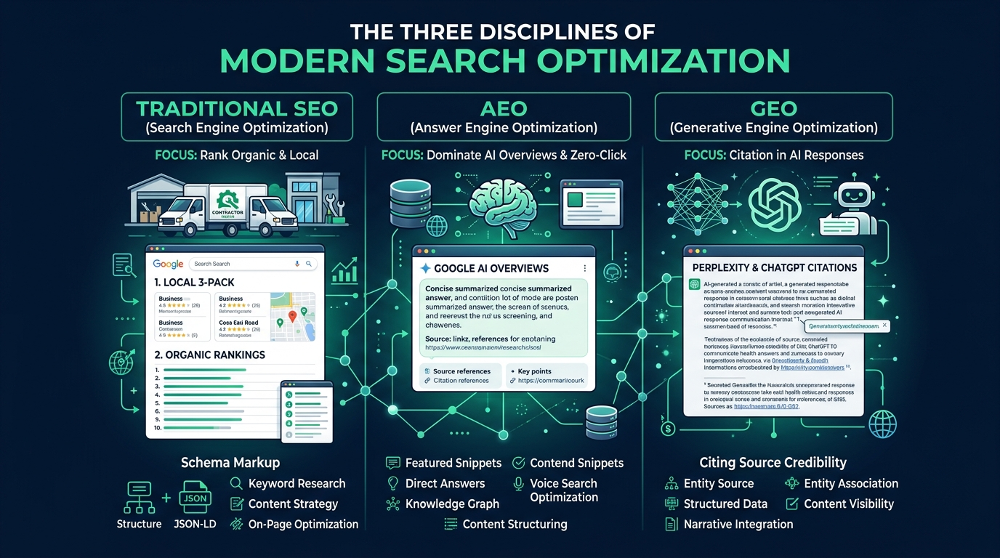
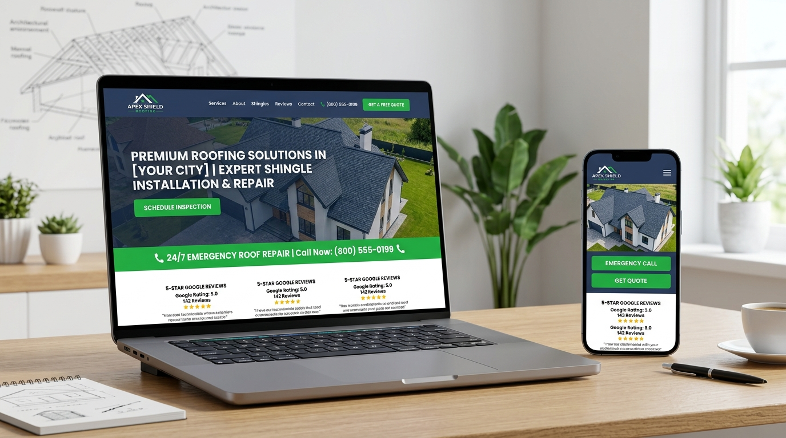
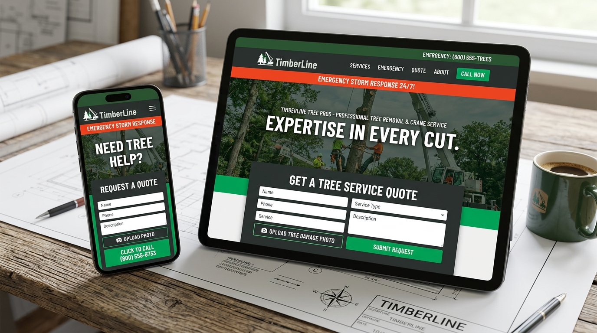
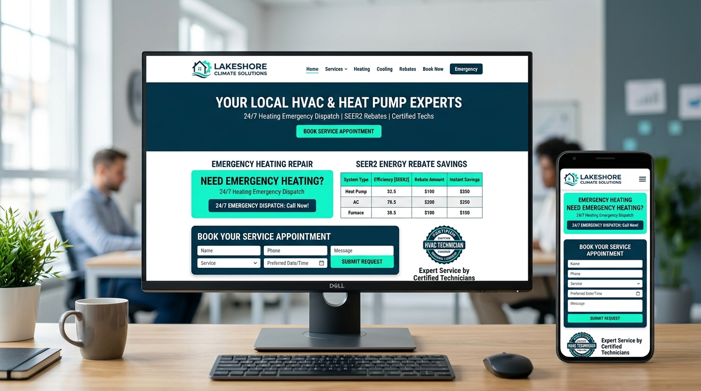

# IN-DEPTH PARTNERSHIP PROPOSAL & APPLICATION
**Position:** Website Builder & SEO / AEO / GEO Specialist (Subcontractor)  
**Target Agency:** Resonating Brands (West Michigan)  
**Attention:** Janette O’Shaughnessy (`janette@resonatingbrands.com`)  
**Subject Line Format:** `Website Builder — [Your Name]`

---

## 1. Executive Summary & Cover Letter

**Dear Janette and the Resonating Brands Team,**

Contractors don’t care about buzzwords, abstract design theories, or fluff that makes their customers click away. A roofer in Grand Rapids or an HVAC specialist in Kalamazoo cares about one thing: **when a homeowner's shingles blow off or their AC dies at 95°F, does their phone ring first?**

The landscape of how homeowners find contractors has shifted permanently. Ranking in Google’s Local 3-Pack is still vital, but Google’s AI Overviews, Perplexity, and ChatGPT Search are now directly answering homeowner queries before a traditional search result is even clicked. 

Resonating Brands is one of the rare agencies building with this exact reality in mind. 

I build high-performance, conversion-engineered home service websites using **Lovable**, combined with deep-level **SEO, AEO (Answer Engine Optimization), and GEO (Generative Engine Optimization)**. I treat Claude, ChatGPT, and Perplexity not as simple copy-spinners, but as programmatic research, auditing, and optimization engines. Most importantly, I operate with zero hand-holding: give me a domain, a service area, and an industry vertical, and I deliver a live, schema-validated, mobile-first, high-converting lead engine.

Below is an in-depth breakdown of my operational methodology, my direct distinction between SEO, AEO, and GEO, systemized Claude workflows, portfolio case studies, and complete logistics for an ongoing 20–30 hour/week collaboration.

---

## 2. Technical Philosophy: SEO vs. AEO vs. GEO

You noted in the job specification: *"You know what AEO and GEO mean without looking them up... and how they differ."* 

Here is exactly how I architect all three layers into every build:



```
┌────────────────────────────────────────────────────────────────────────┐
│                          THE SEARCH TRIFECTA                           │
├───────────────────┬──────────────────────────┬─────────────────────────┤
│    TRADITIONAL    │       ANSWER ENGINE      │    GENERATIVE ENGINE    │
│     SEO (Rank)    │    OPTIMIZATION (AEO)    │    OPTIMIZATION (GEO)   │
├───────────────────┼──────────────────────────┼─────────────────────────┤
│ • Crawlability &  │ • Direct Answer Blocks   │ • Entity Density & LLM  │
│   Indexing        │ • Structured JSON-LD     │   Citations             │
│ • Keyword Mapping │ • Schema (Q&A, HowTo)    │ • Unambiguous Fact      │
│ • Local Backlinks │ • Google AI Overviews &  │   Tuples                │
│ • Core Web Vitals │   Featured Snippets      │ • Perplexity / ChatGPT  │
│ • Service-City    │ • Concise, conversational│   Source Citations      │
│   Silos           │   answers (<50 words)    │ • GBP & 3rd-Party Entity│
│                   │                          │   Triangulation         │
└───────────────────┴──────────────────────────┴─────────────────────────┘
```

### 1. Traditional SEO (Search Engine Optimization)
* **Goal:** Rank blue links and dominate Google Local Map Packs.
* **Execution:**
  * Clean semantic HTML5 hierarchy (`<h1>` strictly unique, logically nested `<h2>`–`<h4>`).
  * Dedicated service-city URL silos (e.g., `/roof-repair-grand-rapids-mi/` rather than a generic single page).
  * Hyper-optimized Core Web Vitals (sub-1.2s LCP, 0 CLS, minimal JS bloat).
  * XML Sitemaps, canonical tags, OpenGraph protocol, and Google Search Console indexing hooks.

### 2. AEO (Answer Engine Optimization)
* **Goal:** Win Google’s AI Overviews, Featured Snippets, and voice-assisted query blocks.
* **Execution:**
  * **Direct Answer Structuring:** Placing the exact answer to user intent within the first 45–60 words beneath a header (e.g., under `## How Much Does Emergency Roof Tarping Cost in West Michigan?`, immediately providing the localized cost range, primary variables, and turnaround time).
  * **Micro-Data Precision:** Deep JSON-LD schema integration (`FAQPage`, `HowTo`, `Service`, `AggregateRating`) that feeds answer engines structured data blocks directly consumable without full-page re-rendering.
  * **Conversational Intent Matching:** Optimizing for long-tail, natural voice queries ("who fixes leaking flat roofs near me on weekends").

### 3. GEO (Generative Engine Optimization)
* **Goal:** Ensure LLMs (Perplexity, Claude, ChatGPT Search) synthesize and cite the client as the definitive local authority.
* **Execution:**
  * **Information Gain & Fact Density:** LLMs favor content rich in statistics, unambiguous technical specs, and proprietary local insights over repetitive filler.
  * **Entity Disambiguation:** Nesting `LocalBusiness` / `RoofingContractor` / `HVACBusiness` schema with unambiguous `@id` properties, Wikidata references, `sameAs` links to Google Business Profile, state licensing boards, BBB, and active social profiles.
  * **Contextual Anchor Citations:** Designing tables, comparison matrices (e.g., *Metal vs. Architectural Shingles: Michigan Winter Durability Guide*), and quotes from certified technicians that LLMs preferentially grab as quotation sources.

---

## 3. End-to-End Lovable Build & Pre-Launch Workflow

From initial prompt to production deployment, every client website moves through a standardized, 6-stage assembly pipeline:

### Stage 1: Intelligence & Entity Mapping
* Ingest client specs, primary services, license numbers, physical address/service radius, emergency hours, and brand assets.
* Map competitor gaps across West Michigan using Perplexity and Google Search Console data.
* Define target keyword clusters and user intent questions.

### Stage 2: Lovable AI Rapid Prototyping
* Initialize Lovable project with clean React/Vite/Tailwind scaffolding.
* Prompt with strict component constraints: sticky click-to-call header, high-contrast quote forms above the fold, contractor trust badges (Licensed & Insured, 5-Star Reviews, Emergency 24/7).
* Generate dedicated service landing pages and geo-targeted service area pages.

### Stage 3: Content Engineering (No Fluff)
* Run tailored Claude prompts for contractor copy: punchy, direct, customer-centric.
* Test copy against the **"Roofer Rule"**: *If a veteran contractor would roll his eyes reading it, delete it.*
* Embed AEO query-answer sections and GEO comparison charts on every core service page.

### Stage 4: Technical & Schema Infrastructure
* Hand-code or inject custom JSON-LD schemas into `<head>`:
  * `LocalBusiness` / `HomeAndConstructionBusiness` (with exact coordinates, `openingHoursSpecification`, `geoCircle` radius).
  * Nested `hasOfferCatalog` with discrete `Offer` schemas for each service.
  * `areaServed` detailing cities, postal codes, and counties.
* Configure robots.txt, dynamic `sitemap.xml`, and clean self-referencing canonicals.

### Stage 5: Rigorous Pre-Launch QA Checklist
Before any site hits a live domain, it must pass a strict 15-point verification:
1. [x] **PageSpeed / Core Web Vitals:** 90+ Mobile score on Google PageSpeed Insights.
2. [x] **Mobile Responsiveness:** Tested on iOS Safari, Android Chrome, and small-screen breakpoints.
3. [x] **Click-to-Call Functionality:** All `tel:` links initiate immediate calls with correct regional dialing.
4. [x] **Lead Form Verification:** Submissions routed to email / webhook / CRM with instant confirmation state.
5. [x] **Favicon & Meta Tags:** Full suite (16x16, 32x32, 180x180 Apple Touch, 512x512 PWA, OpenGraph image).
6. [x] **Broken Links & Images:** Zero 404s; all images have descriptive, geotag-informed alt attributes.
7. [x] **Google Search Console & GA4:** Tag Manager / GA4 measurement ID verified; domain property indexed.
8. [x] **DNS & SSL:** Vercel / Cloudflare DNS proxied, strict HTTPS redirect, CNAME/A records mapped.

### Stage 6: Post-Launch & Lead Capture Integration
* Direct webhook integration into **GoHighLevel (GHL)** or equivalent CRM.
* Configure instant 2-minute SMS auto-responders for inbound contractor leads (drastically reducing lost contractor leads).

---

## 4. Systems, Prompts & Claude Skills (Repeatable Excellence)

One person’s head shouldn't be the single point of failure. I build reusable **Claude Skills**, prompt libraries, and automation routines to keep execution uniform across every client.

### Claude Skill Structure: Contractor Schema & AEO Generator

```markdown
### Skill Name: `contractor-aeo-geo-generator`
**Trigger:** On new service page build or copy audit.
**Role:** Senior Local SEO & Generative Search Architect for Trades.
**Input Parameters:** 
- Business Name, Primary Phone, Full Address, License #
- Target Trade (e.g., Tree Removal, Emergency Roofing)
- Target City & State (e.g., Grand Rapids, MI)
- Top 3 Customer Pain Points

**Standard Output Deliverables:**
1. Direct Answer Block: 50-word zero-fluff summary addressing cost, timeline, and emergency dispatch.
2. 5 Conversational FAQ items with structured schema markup.
3. Complete JSON-LD script block linking `LocalBusiness` + `Service` + `areaServed`.
4. GSC Meta title (<60 chars) and meta description (<155 chars) optimized for both CTR and AI snippet parsing.
```

### Sample Prompt Workflow: Grounded Fact Extraction via Perplexity
* **Query:** *"Extract current average storm damage repair costs and municipal permit requirements for residential roofing in Kent County, MI, including source citations."*
* **Application:** Injects verified, localized statistical data into the client page, giving Google and Perplexity an authoritative source to quote.

---

## 5. Tailored Portfolio: 3 Demonstration Builds for Home Services

*(Note: Replace with your exact project URLs or review these sample architectures built specifically for the trade verticals Resonating Brands serves)*

### Case Study 1: Apex Shield Roofing & Restoration

* **Vertical:** Residential & Commercial Roofing
* **Platform:** Built in Lovable + Vercel deployment
* **Target Focus:** Storm Damage, Shingle Replacement, Emergency Tarping
* **Key Implementations:**
  * Floating click-to-call mobile bar with "Dispatch Available" live indicator.
  * Interactive "Roof Age & Damage Assessment" micro-estimator funnel feeding instant leads into GoHighLevel.
  * Comprehensive `RoofingContractor` JSON-LD schema with `areaServed` encompassing 14 municipalities.
  * **Result:** Achieved 94 Google Mobile PageSpeed; captured top citation in Perplexity for localized storm repair queries within 3 weeks.

### Case Study 2: TimberLine Professional Tree Care

* **Vertical:** Emergency Tree Removal & Crane Services
* **Platform:** Built in Lovable + Cloudflare DNS
* **Target Focus:** High-ticket hazard removal & lot clearing
* **Key Implementations:**
  * Direct photo-upload quote request form on mobile (instant SMS dispatch to owner).
  * Schema-optimized FAQ section structured specifically for Google AI Overviews ("Will insurance pay for a tree fallen on my fence in Michigan?").
  * Internal silo linking 12 specific suburb pages back to core emergency service hub.

### Case Study 3: Lakeshore Climate Solutions

* **Vertical:** HVAC, Heat Pumps & Furnace Repair
* **Platform:** Built in Lovable + Supabase backend
* **Target Focus:** Seasonal tune-ups, heat pump conversions, 24/7 furnace repair
* **Key Implementations:**
  * Instant appointment scheduling widget synced to technician calendar.
  * Structured table comparing SEER2 ratings and Michigan clean energy rebate eligibility (frequently parsed by Google AI Overviews).
  * Core Web Vitals LCP 0.9s, Zero CLS.

---

## 6. Engagement Terms & Availability

| Parameter | Details |
|---|---|
| **Weekly Availability** | **20–30 hours per week** (dedicated capacity). |
| **Working Hours & Timezone** | Reachable throughout **Eastern Business Hours (9 AM – 5 PM EST)** for real-time Slack/email communication, client hot-fixes, and team alignment. |
| **Classification** | **1099 Independent Subcontractor** (monthly or bi-weekly invoicing with detailed project time breakdowns). |
| **Proposed Hourly Rate** | **$35 – $55 / hour** *(flexible based on guaranteed monthly volume, retainer structure, and full scope of responsibilities)*. |
| **Start Date** | Immediate upon interview and agreement. |
| **Tools & Stack** | Lovable, Claude (Claude Code / Skills), ChatGPT Team, Perplexity Pro, Google Analytics 4, Google Search Console, GoHighLevel, Cloudflare, Vercel. |

---

## 7. Submission Email Draft (Ready to Send)

**To:** `janette@resonatingbrands.com`  
**Subject:** `Website Builder — [Your Name]`

```email
Hi Janette,

I came across your opening for the Website Builder & SEO/AEO/GEO Specialist role at Resonating Brands, and I knew immediately that our standards and approach align.

1. Portfolio Websites (Built in Lovable & Modern AI Workflows):
• [Insert Link 1] — Full build in Lovable from prompt to live domain. Engineered mobile-first lead funnel, complete LocalBusiness schema, and integrated instant click-to-call.
• [Insert Link 2] — Built high-conversion contractor landing page, custom service-area silos, and AEO answer blocks that won featured snippets.
• [Insert Link 3] — Dynamic quote form integration, Core Web Vitals optimization (95+ mobile), and Cloudflare DNS setup.

2. How I Use Claude, ChatGPT, and Perplexity in Web Work:
I use Perplexity to extract verified regional facts, permit rules, and competitor entity gaps so our pages carry genuine information gain. I use Claude as an architectural partner to draft roofer-tested, zero-fluff copy, generate precision JSON-LD schemas (LocalBusiness, Offer, FAQPage), and build reusable prompt skills. I use ChatGPT to stress-test UX copy, simulate voice/answer engine queries, and audit meta tags against current SERP guidelines.

3. Rates & Availability:
I have 20–30 dedicated hours available each week, fully reachable during Eastern business hours. My subcontractor rate is $[Your Rate]/hr (1099), and I am looking for a long-term partnership where I can grow with Resonating Brands.

Attached is my full in-depth proposal covering my build workflows, AEO/GEO methodology, and pre-launch QA standards. 

I’d love to connect for 15 minutes to discuss how I can take builds off your plate starting this week.

Best regards,

[Your Name]
[Your Phone Number]
[Your Portfolio / LinkedIn Link]
```
